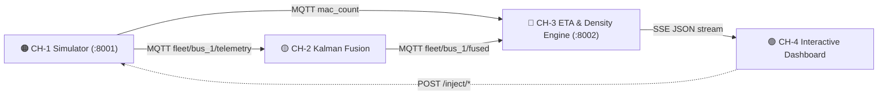

# TransitSense — Smart India Hackathon 2026 Project

> Real-time Public Transit Intelligence Platform delivering continuous bus ETAs, occupancy density, and sensor fusion.

## Core Architecture

## Data Contracts & Port Allocations
- MQTT Broker: `localhost:1883`
- Telemetry Topic: `fleet/bus_1/telemetry`
- Fused Position Topic: `fleet/bus_1/fused`
- ETA SSE Stream: `http://localhost:8002/stream`
- ETA REST API: `http://localhost:8002/eta`
- Simulator REST API: `http://localhost:8001/inject/*`
