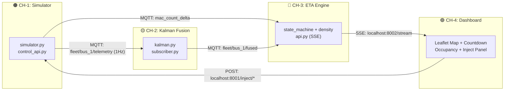

# TransitSense — Agent Instructions (ROOT)

> **Read this entire file before writing a single line of code.**
> These instructions apply to every AI coding agent working on this project, regardless of channel.

---

## What This Project Is

**TransitSense** is a Smart India Hackathon (SIH) 2026 public transit intelligence platform.

The hackathon build is a **simulated-but-real pipeline**: synthetic GPS/sensor data flows through real code (Kalman filter, ETA engine, density aggregator) and surfaces on a real dashboard. Judges see a live, interactive demo — not a mockup.

**One-sentence pitch**: *"Watch this bus disappear from Route A and instantly become a live, shrinking ETA on Route B — before it's even arrived."*

---

## Architecture Overview



Each channel is a separate folder in this repo. You work in your channel folder only.

---

## Strict Rules — Violations Will Break Other Teammates' Work

### 1. Never change the shared data contracts
The MQTT topic names, payload field names, port numbers, and `block_id` are **fixed contracts**. Changing them breaks every channel downstream.

| Contract | Locked Value |
|---|---|
| MQTT broker | `localhost:1883` |
| Raw telemetry topic | `fleet/bus_1/telemetry` |
| Fused position topic | `fleet/bus_1/fused` |
| ETA SSE stream | `http://localhost:8002/stream` |
| ETA REST | `http://localhost:8002/eta` |
| Simulator control API | `http://localhost:8001/inject/*` |
| `block_id` | `"block_001"` |
| Bus seated capacity | `40` |
| Bus max capacity | `55` |

All constants live in `shared/constants.py`. **Import from there. Do not hardcode.**

### 2. Always import constants from `shared/constants.py`
```python
import sys; sys.path.insert(0, '..')
from shared.constants import *
```

### 3. Stay in your channel folder
- CH-1 → `simulator/`
- CH-2 → `kalman_service/`
- CH-3 → `eta_engine/`
- CH-4 → `dashboard/`
- Shared utilities → `shared/`

Do not create files outside your channel folder unless adding to `shared/`. Always check before touching `shared/`.

### 4. Never commit secrets
- Never write API keys, passwords, or tokens in code
- All secrets go in `.env` (already gitignored)
- Reference them via `os.environ.get("KEY_NAME")`

### 5. MQTT payload fields are append-only
If you need to add a field to a payload, you may add it. You may **never rename or remove** existing fields. Downstream services depend on them.

### 6. Keep services running as blocking processes
Each service runs as a long-lived process (`while True` or `loop_forever()`). Do not write one-shot scripts for services.

### 7. No database for hackathon build
State is in-memory only. No PostgreSQL, SQLite, Redis, etc. in any service. (Neon DB is reserved for the full production build, not the hackathon simulator.)

### 8. End-to-end latency target: < 2 seconds
From any injected event (delay/dropout/crowd) to visible UI change in CH-4. Optimize if your component adds more than 500ms.

### 9. Do not invent demo data
The simulator (CH-1) is the single source of truth for all test data. Do not hardcode fake ETAs or occupancy values in CH-3 or CH-4.

### 10. Always auto-organize and sort code files
- **Sort imports automatically**: Group imports cleanly: (1) Standard library, (2) Third-party packages, (3) Local project modules — all sorted alphabetically within groups.
- **File layout order**: Place constants/types at top, helper classes/functions in middle, main loops/API endpoints at bottom.
- **Module organization**: Keep code organized in dedicated modules; split functions over 40 lines into separate helper files (`utils.py`, `types.ts`, `helpers.py`).
- **Clean workspace**: Auto-clean temporary scratch files, unused assets, or debug prints before committing.

### 11. Make atomic commits
- **Single logical change per commit**: Each commit must contain changes for exactly one task, feature, or fix.
- **Never bundle unrelated work**: Do not combine refactoring, styling, and feature logic into a single commit.
- **Clean commit scope & message**: Use Conventional Commits (`feat(chN): ...`, `fix(chN): ...`, `refactor(chN): ...`). Ensure project builds and tests pass cleanly at every commit checkpoint.

### 12. Leverage project & global skills
- **Check available skills**: Before starting UI design, PDF processing, research, or complex tasks, inspect `.agents/skills/` or global skills available in your workspace.
- **Follow skill workflows**: When a task matches a skill (e.g. `impeccable` for frontend UI/UX, `pdf` for PDF processing, `gemini-deep-research` for research), read its `SKILL.md` first and adhere strictly to its workflow and quality bar.

### 13. Use Mermaid for all flowcharts and diagrams
- **Never use ASCII art** for architecture diagrams, flowcharts, or state machines.
- **Always use Mermaid** (` ```mermaid `) blocks inside Markdown files.
- Supported diagram types: `flowchart`, `sequenceDiagram`, `stateDiagram-v2`, `classDiagram`, `gantt`.
- Quote node labels containing special characters (e.g. `id["Label (Extra)"]`).
- Keep diagrams readable: max 15 nodes per diagram; split larger systems into sub-diagrams.

---

## Shared Setup (run once, first)

```bash
# MQTT broker (one teammate runs this)
docker run -d --name mqtt-broker -p 1883:1883 eclipse-mosquitto

# Verify
mosquitto_pub -h localhost -t test -m hello
mosquitto_sub -h localhost -t test
```

Install shared Python deps:
```bash
pip install paho-mqtt fastapi uvicorn
```

---

## Python Style Rules

- Python 3.10+
- Use `paho-mqtt` for all MQTT operations
- Use `fastapi` + `uvicorn` for all HTTP/SSE APIs
- No `asyncio` in MQTT subscribers (use `loop_start()` + `loop_forever()`)
- Type-hint all function signatures
- Keep functions under 40 lines — split if larger

---

## TypeScript / Frontend Rules (CH-4 only)

- Use React functional components with hooks
- SSE via native browser `EventSource` (no libraries)
- No WebSockets — SSE only for transit stream
- No global state libraries (Redux etc.) — React `useState` + custom hook is enough
- All inject calls use `fetch(..., { method: "POST" })` to `localhost:8001`

---

## Startup Order (full pipeline)

```bash
# Terminal 1
docker start mqtt-broker

# Terminal 2 — CH-1
python simulator/simulator.py &
python simulator/control_api.py

# Terminal 3 — CH-2
python kalman_service/subscriber.py

# Terminal 4 — CH-3
python eta_engine/api.py

# Terminal 5 — CH-4
cd dashboard && npm run dev
```

---

## Channel-Specific Instructions

Each channel folder has its own `AGENTS.md` with detailed per-channel rules. Read your channel's `AGENTS.md` **in addition to this root file**.

| Channel | Folder | Agent Instructions |
|---|---|---|
| CH-1 Simulator | `simulator/` | `simulator/AGENTS.md` |
| CH-2 Kalman Fusion | `kalman_service/` | `kalman_service/AGENTS.md` |
| CH-3 ETA Engine | `eta_engine/` | `eta_engine/AGENTS.md` |
| CH-4 Dashboard | `dashboard/` | `dashboard/AGENTS.md` |

---

## Demo Success Criteria (what judges evaluate)

- [ ] Bus visible on map moving in real-time
- [ ] Outbound bus shows "Completing prior route" with live inbound ETA
- [ ] Inject Delay → countdown jumps within 2s
- [ ] Inject Dropout → map path stays smooth (no teleport)
- [ ] Inject Crowd → occupancy badge changes on inbound trip
- [ ] Event log shows cause → effect from single button press
- [ ] All four numbers change from one inject (pipeline is connected, not isolated)

---

## Strict Git Branching & Pull Request Workflow

### 1. Automatic Branch Creation
Every teammate's agent MUST automatically create and switch to a dedicated feature branch before making any edits:
```bash
git checkout -b <teammate-name>/<task-name>
# Example: git checkout -b alex/ch1-simulator-engine
```

### 2. Direct Pushes to `main` are Strictly Forbidden
- **`main` is a protected branch.** Never run `git push origin main`.
- All work MUST happen inside your feature branch.

### 3. Open Pull Request (PR) / Merge Request
Once your atomic commits pass local verification:
```bash
git push -u origin <teammate-name>/<task-name>
```
Create a Pull Request on GitHub targeting `main`.

### 4. Owner Approval Gate (Srivarsan Only)
- **Only the repository owner (Srivarsan) has authority to merge PRs into `main`.**
- Collaborators DO NOT have merge privileges. Do not attempt to self-merge or force-merge.

### 5. Post-Merge Branch Cleanup & New Task Setup
Once Srivarsan approves and merges your PR into `main`:
1. Delete the merged branch locally and remotely:
   ```bash
   git checkout main
   git pull origin main
   git branch -d <old-branch-name>
   git push origin --delete <old-branch-name>
   ```
2. Create a fresh branch for your next task:
   ```bash
   git checkout -b <teammate-name>/<next-task-name>
   ```
