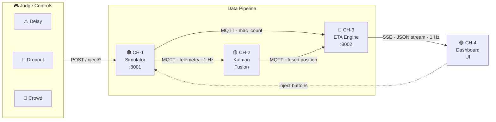
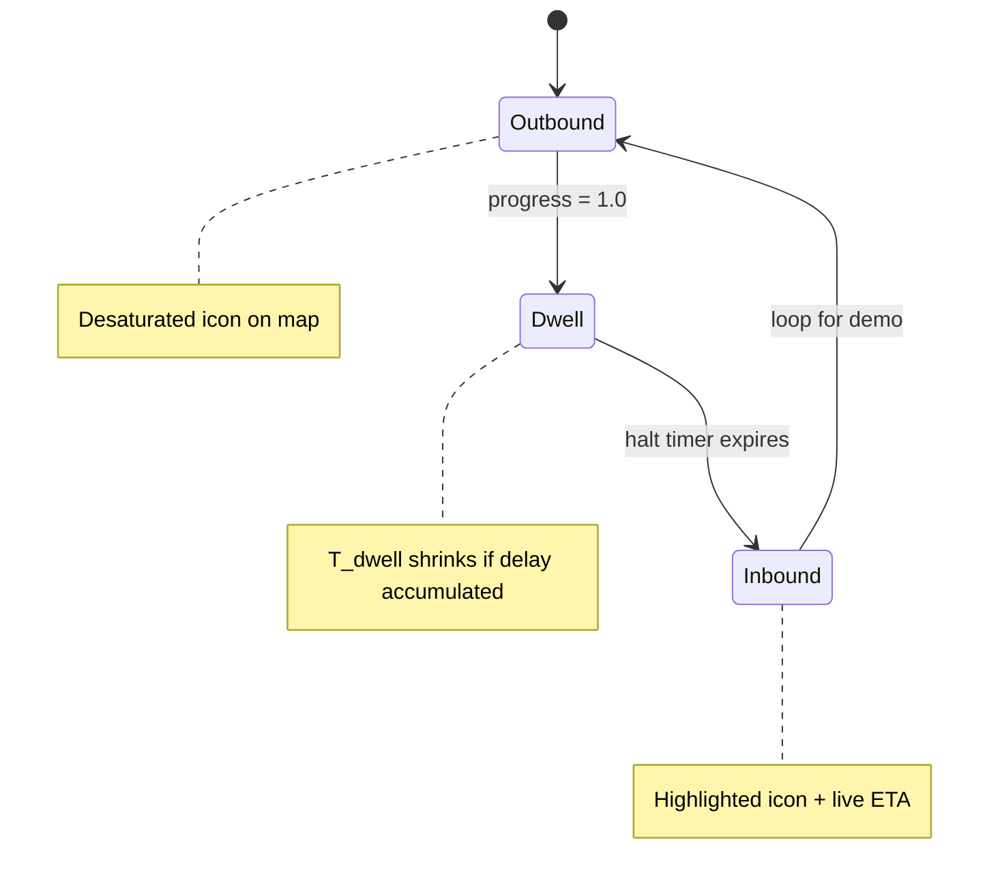

# 🚌 TransitSense

> **Smart India Hackathon (SIH) 2026 Public Transit Intelligence Platform**  
> *Privacy-First, Offline-Tolerant, Low-Cost Predictive Transit Engine & Live Dashboard*

---

## 🎯 Pitch & Vision

> *"Watch this bus disappear from Route A and instantly become a live, shrinking ETA on Route B — before it has even arrived at the terminal."*

Existing public transport apps treat bus trips in isolated silos: when a bus is completing an outbound journey (Station A → Station B), waiting commuters on the return leg (Station B → Station A) see **zero vehicle availability**. This **Trip-Bound Visibility Gap** causes commuter anxiety, overcrowding, and lost trust.

**TransitSense** connects continuous vehicle assets across scheduled route blocks (`block_id`). It projects **compounding ETAs** ($T_{\text{outbound}} + T_{\text{dwell}} + T_{\text{inbound}}$) and **passenger occupancy bands** in real time—even while the bus is still en route on its prior leg.

---

## 🏗️ Pipeline Architecture



### Bus Lifecycle State Machine



---

## 📦 System Channels & Modules

| Channel | Directory | Tech Stack | Role & Responsibilities |
|---|---|---|---|
| 🟠 **CH-1** | `simulator/` | Python 3.10, FastAPI, Paho-MQTT | **Simulator Engine**: Generates 1Hz telemetry along GTFS shapes. Exposes REST endpoints to inject live delays, GNSS dropouts, and crowd spikes. |
| 🟡 **CH-2** | `kalman_service/` | Python 3.10, NumPy, Paho-MQTT | **Kalman Fusion Service**: Fuses noisy GNSS and cell triangulation coordinates. Maintains smooth vehicle trajectory ($R_{\text{cell}} = 1000 \times R_{\text{gnss}}$) during dropouts. |
| 🔵 **CH-3** | `eta_engine/` | Python 3.10, FastAPI, Uvicorn | **ETA & Density Engine**: Calculates compounding ETAs, applies dynamic halt-time recovery logic, aggregates occupancy bands, and serves SSE stream. |
| 🟢 **CH-4** | `dashboard/` | Astro.js, React, Leaflet, SSE | **Interactive Kiosk & Dashboard**: User-facing UI showing real-time vehicle movement, countdowns, occupancy badges, judge controls, and event log. |
| ⚙️ **Shared** | `shared/` | Python 3.10 | **Shared Contracts**: Holds locked constants (`constants.py`), ports, topic names, and capacity thresholds imported by all services. |

---

## 🚀 Quick Start & Local Setup

### Prerequisites
- Python 3.10+
- Node.js 18+
- Docker (for Mosquitto MQTT broker)

### 1. Start MQTT Broker
```bash
docker run -d --name mqtt-broker -p 1883:1883 eclipse-mosquitto
```

### 2. Install Dependencies
```bash
# Python dependencies
pip install paho-mqtt fastapi uvicorn numpy

# Dashboard dependencies
cd dashboard
npm install
cd ..
```

---

## ⚙️ Running the Full Pipeline

Launch each service in a separate terminal:

```bash
# Terminal 1 — CH-1 Simulator Engine & Control API
python simulator/simulator.py & python simulator/control_api.py

# Terminal 2 — CH-2 Kalman Fusion Service
python kalman_service/subscriber.py

# Terminal 3 — CH-3 ETA & Density Engine (SSE API)
python eta_engine/api.py

# Terminal 4 — CH-4 Dashboard (User Interface)
cd dashboard && npm run dev
```

Open **`http://localhost:4321`** (or `http://localhost:3000` for Next.js) in your browser.

---

## 🎮 Interactive Judge Demo (90-Second Sequence)

Judges evaluate the **single connected pipeline** through the dashboard control panel:

1. **Observe Baseline**: Watch the desaturated bus icon move along Route A. Notice that waiting commuters on Route B *already see* a live, shrinking inbound ETA.
2. **Click `⚠️ Inject Delay (+5 min)`**:
   - Outbound travel time ($T_{\text{outbound}}$) increases.
   - Terminal halt time ($T_{\text{dwell}}$) dynamically shrinks to recover schedule.
   - Inbound ETA countdown updates instantly (< 2s latency).
   - Event log records `Delay +5min injected → ETA recalculated`.
3. **Click `📡 GNSS Dropout (10s)`**:
   - Raw GPS emits noisy offset coordinates.
   - Kalman filter suppresses noise ($R_{\text{cell}}$ weighting).
   - Bus path stays smooth on map—zero visual teleportation.
4. **Click `👥 Crowd Spike (+20 pax)`**:
   - Rolling MAC window count rises.
   - Occupancy badge shifts from 🟢 **Seats Available** to 🟠 **Standing Room**.
   - Occupancy updates on both current vehicle and pre-published return trip.
5. **Verify Connected Pipeline**: All 4 dashboard panels reflect the changes from a single click.

---

## 🔒 Shared Data Contracts (`shared/constants.py`)

All services strictly adhere to locked contracts:

| Contract | Value |
|---|---|
| MQTT Broker | `localhost:1883` |
| Telemetry Topic | `fleet/bus_1/telemetry` |
| Fused Position Topic | `fleet/bus_1/fused` |
| Simulator Control API | `http://localhost:8001/inject/*` |
| ETA SSE Stream | `http://localhost:8002/stream` |
| Block ID | `"block_001"` |
| Bus Seated / Max Capacity | `40` / `55` |

---

## 🛠️ Repository Structure

```
SIH-inthack-2026/
├── AGENTS.md                   # Root agent instructions & git rules
├── PRODUCT.md                  # Impeccable product context & specifications
├── README.md                   # Project overview & startup guide
├── shared/
│   └── constants.py            # Central shared constants
├── simulator/                  # CH-1: Telemetry simulator & REST API
│   ├── AGENTS.md
│   ├── simulator.py
│   ├── control_api.py
│   └── route_geometry.py
├── kalman_service/             # CH-2: Kalman sensor fusion engine
│   ├── AGENTS.md
│   ├── kalman.py
│   ├── subscriber.py
│   └── verify.py
├── eta_engine/                 # CH-3: State machine, ETA & density API
│   ├── AGENTS.md
│   ├── state_store.py
│   ├── consumers.py
│   ├── eta.py
│   ├── density.py
│   └── api.py
├── dashboard/                  # CH-4: Astro/React Leaflet dashboard UI
│   ├── AGENTS.md
│   ├── src/
│   └── public/
└── docs/                       # Literature reviews & research reports
```

---

## 👥 Git Branching & Contribution Workflow

### ⚡ One-Command Agent Setup
Tell your AI coding agent this exact sentence to start working:

> **"Start task in channel <CH-1|CH-2|CH-3|CH-4>. My name is <YourName>."**

Your agent will:
1. Ask your name if missing.
2. Automatically create your task branch: `git checkout -b <your-name>/<channel>-<task>`.
3. Load root `AGENTS.md` and your channel's `AGENTS.md`.
4. Stay scoped strictly inside your channel directory and begin Phase 1.

### 🔄 PR & Merge Rules
1. Follow strict atomic commit rules using Conventional Commits (`feat(chN): ...`, `fix(chN): ...`).
2. Push to origin and open a Pull Request targeting `main`.
3. **Merge Approval Gate**: Only repository owner (**Srivarsan**) can merge PRs into `main`.
4. Post-merge: delete merged branch (`git branch -d`, `git push origin --delete`) and pull updated `main`.

---

## 📜 License & Compliance

Built for **Smart India Hackathon (SIH) 2026**. All research, specs, and code are open for civic transit intelligence innovation.
