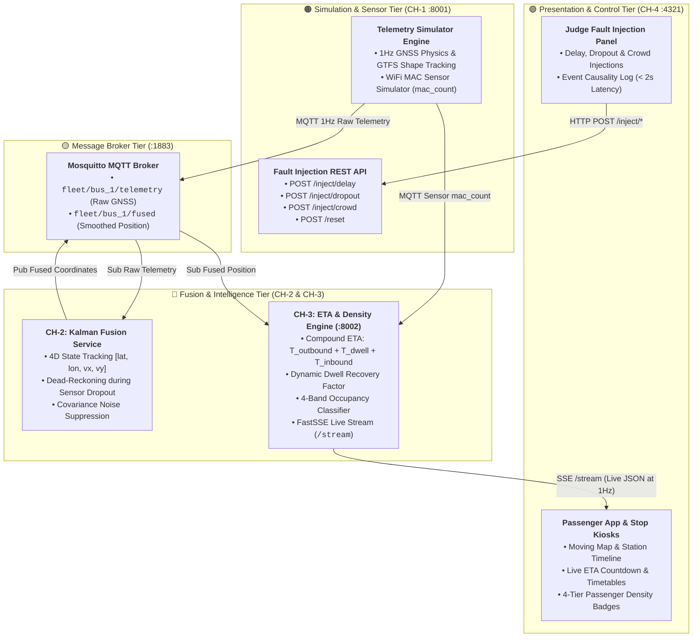
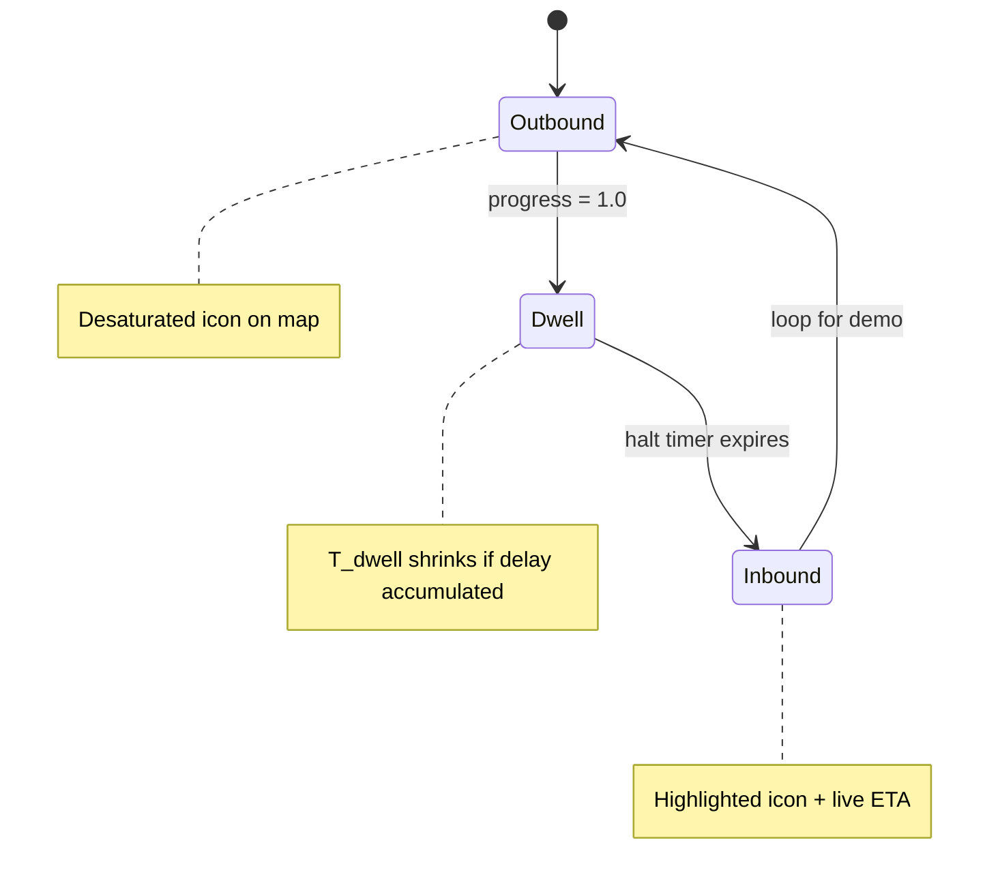

# 🚌 Yara

> **Smart India Hackathon (SIH) 2026 Public Transit Intelligence Platform**  
> *Privacy-First, Offline-Tolerant, Low-Cost Predictive Transit Engine & Live Dashboard*

---

## ⚡ Quick Agent Bootstrap (For Teammates)

Copy and paste this prompt directly into your AI Coding Agent to start working immediately:

```text
Start task in channel <CH-1|CH-2|CH-3|CH-4>. My name is <YourName>.
```

**Ready-to-copy example:**
```text
Start task in channel CH-1. My name is Alex.
```

**What your AI Agent will automatically do:**
1. **Identify Name & Task**: Asks for your name if missing.
2. **Branch Creation**: Runs `git checkout -b <your-name>/<channel>-<task>` before editing any file.
3. **Load Rules**: Reads `AGENTS.md` and `<channel-folder>/AGENTS.md`.
4. **Scope Lock**: Scopes work strictly inside `<channel-folder>/` and `shared/constants.py`.
5. **Begin Work**: Inspects phase checklist in your channel's `AGENTS.md` and starts Phase 1.

---

## 🎯 The Core Innovation

In public transit networks, when a bus runs late on **Route A (Outbound)**, passengers waiting at terminal **Station B for Route B (Inbound)** are left stranded without reliable information.

**Yara** connects continuous vehicle assets across scheduled route blocks (`block_id`). It projects **compounding ETAs** ($T_{\text{outbound}} + T_{\text{dwell}} + T_{\text{inbound}}$) and **passenger occupancy bands** in real time—even while the bus is still en route on its prior leg.

---

## 🏗️ System Interaction Overview


```mermaid
flowchart TB
    subgraph T1["🟠 Simulation & Sensor Tier (CH-1 :8001)"]
        direction TB
        SIM["<b>Telemetry Simulator Engine</b><br/>• 1Hz GNSS Physics & GTFS Shape Tracking<br/>• WiFi MAC Sensor Simulator (mac_count)"]
        API["<b>Fault Injection REST API</b><br/>• POST /inject/delay<br/>• POST /inject/dropout<br/>• POST /inject/crowd<br/>• POST /reset"]
    end

    subgraph T2["🟡 Message Broker Tier (:1883)"]
        MQTT["<b>Mosquitto MQTT Broker</b><br/>• <code>fleet/bus_1/telemetry</code> (Raw GNSS)<br/>• <code>fleet/bus_1/fused</code> (Smoothed Position)"]
    end

    subgraph T3["🔵 Fusion & Intelligence Tier (CH-2 & CH-3)"]
        direction TB
        KAL["<b>CH-2: Kalman Fusion Service</b><br/>• 4D State Tracking [lat, lon, vx, vy]<br/>• Dead-Reckoning during Sensor Dropout<br/>• Covariance Noise Suppression"]
        ETA["<b>CH-3: ETA & Density Engine (:8002)</b><br/>• Compound ETA: T_outbound + T_dwell + T_inbound<br/>• Dynamic Dwell Recovery Factor<br/>• 4-Band Occupancy Classifier<br/>• FastSSE Live Stream (<code>/stream</code>)"]
    end

    subgraph T4["🟢 Presentation & Control Tier (CH-4 :4321)"]
        direction TB
        UI["<b>Passenger App & Stop Kiosks</b><br/>• Moving Map & Station Timeline<br/>• Live ETA Countdown & Timetables<br/>• 4-Tier Passenger Density Badges"]
        JUDGE["<b>Judge Fault Injection Panel</b><br/>• Delay, Dropout & Crowd Injections<br/>• Event Causality Log (&lt; 2s Latency)"]
    end

    SIM -->|"MQTT 1Hz Raw Telemetry"| MQTT
    SIM -->|"MQTT Sensor mac_count"| ETA
    MQTT -->|"Sub Raw Telemetry"| KAL
    KAL -->|"Pub Fused Coordinates"| MQTT
    MQTT -->|"Sub Fused Position"| ETA
    ETA -->|"SSE /stream (Live JSON at 1Hz)"| UI
    JUDGE -->|"HTTP POST /inject/*"| API
```

### Bus Lifecycle State Machine


```mermaid
stateDiagram-v2
    [*] --> Outbound
    Outbound --> Dwell : progress = 1.0
    Dwell --> Inbound : halt timer expires
    Inbound --> Outbound : loop for demo

    note right of Outbound : Desaturated icon on map
    note right of Dwell : T_dwell shrinks if delay accumulated
    note right of Inbound : Highlighted icon + live ETA
```

---

## 📦 System Channels & Modules

| Channel | Directory | Tech Stack | Role & Responsibilities |
|---|---|---|---|
| 🟠 **CH-1** | `simulator/` | Python 3.10, FastAPI, Paho-MQTT | **Simulator Engine**: Generates 1Hz telemetry along GTFS shapes. Exposes REST endpoints to inject live delays, GNSS dropouts, and crowd spikes. |
| 🟡 **CH-2** | `kalman_service/` | Python 3.10, NumPy, Paho-MQTT | **Kalman Fusion Service**: Fuses noisy GNSS and cell triangulation coordinates. Maintains smooth vehicle trajectory ($R_{\text{cell}} = 1000 \times R_{\text{gnss}}$) during dropouts. |
| 🔵 **CH-3** | `eta_engine/` | Python 3.10, FastAPI, Uvicorn | **ETA & Density Engine**: Calculates compounding ETAs, applies dynamic halt-time recovery logic, aggregates occupancy bands, and serves SSE stream. |
| 🟢 **CH-4** | `dashboard/` | Astro.js, React, Leaflet, SSE | **Interactive Kiosk & Dashboard**: User-facing UI showing real-time vehicle movement, countdowns, occupancy badges, judge controls, and event log. |
| ⚙️ **Shared** | `shared/` | Python 3.10 | **Shared Contracts**: Holds locked constants (`constants.py`), ports, topic names, and capacity thresholds imported by all services. |

---

## 💻 Teammate Local Setup Guide (Per Channel)

### 1. Base Setup (All Teammates)
```bash
# Clone repository
git clone https://github.com/SrivarsanK/SIH-inthack-2026.git
cd SIH-inthack-2026

# Install shared Python dependencies
pip install paho-mqtt fastapi uvicorn numpy
```

---

### 2. Run Your Assigned Channel

#### 🟠 CH-1: Simulator Engine (Teammate A)
```bash
# Terminal 1 — Start MQTT Broker (one person runs this)
docker run -d --name mqtt-broker -p 1883:1883 eclipse-mosquitto

# Terminal 2 — Run Telemetry Simulator & Control API (port 8001)
python simulator/simulator.py & python simulator/control_api.py
```
👉 **Agent Prompt:**
```text
Start task in channel CH-1. My name is <YourName>.
```

---

#### 🟡 CH-2: Kalman Fusion Service (Teammate B)
```bash
# Run Kalman Fusion Subscriber & Smoother
python kalman_service/subscriber.py
```
👉 **Agent Prompt:**
```text
Start task in channel CH-2. My name is <YourName>.
```

---

#### 🔵 CH-3: ETA Engine & Density Aggregator (Teammate C)
```bash
# Run ETA Engine & SSE Stream Server (port 8002)
python eta_engine/api.py
```
👉 **Agent Prompt:**
```text
Start task in channel CH-3. My name is <YourName>.
```

---

#### 🟢 CH-4: Dashboard UI (Srivarsan / Teammate D)
```bash
# Install frontend deps & launch dev server (port 4321)
cd dashboard
npm install
npm run dev
```
👉 **Agent Prompt:**
```text
Start task in channel CH-4. My name is Srivarsan.
```

---

## ⚙️ Running the Full Pipeline

Launch each service in a separate terminal:

```bash
# Terminal 1 — CH-1 Simulator Engine & Control API
python simulator/simulator.py & python simulator/control_api.py

# Terminal 2 — CH-2 Kalman Fusion Service
python kalman_service/subscriber.py

# Terminal 3 — CH-3 ETA & Density Engine (SSE API)
python eta_engine/api.py

# Terminal 4 — CH-4 Dashboard (User Interface)
cd dashboard && npm run dev
```

Open **`http://localhost:4321`** (or `http://localhost:3000` for Next.js) in your browser.

---

## 🎮 Interactive Judge Demo (90-Second Sequence)

Judges evaluate the **single connected pipeline** through the dashboard control panel:

1. **Observe Baseline**: Watch the desaturated bus icon move along Route A. Notice that waiting commuters on Route B *already see* a live, shrinking inbound ETA.
2. **Click `⚠️ Inject Delay (+5 min)`**:
   - Outbound travel time ($T_{\text{outbound}}$) increases.
   - Terminal halt time ($T_{\text{dwell}}$) dynamically shrinks to recover schedule.
   - Inbound ETA countdown updates instantly (< 2s latency).
   - Event log records `Delay +5min injected → ETA recalculated`.
3. **Click `📡 GNSS Dropout (10s)`**:
   - Raw GPS emits noisy offset coordinates.
   - Kalman filter suppresses noise ($R_{\text{cell}}$ weighting).
   - Bus path stays smooth on map—zero visual teleportation.
4. **Click `👥 Crowd Spike (+20 pax)`**:
   - Rolling MAC window count rises.
   - Occupancy badge shifts from 🟢 **Seats Available** to 🟠 **Standing Room**.
   - Occupancy updates on both current vehicle and pre-published return trip.
5. **Verify Connected Pipeline**: All 4 dashboard panels reflect the changes from a single click.

---

## 🔒 Shared Data Contracts (`shared/constants.py`)

All services strictly adhere to locked contracts:

| Contract | Value |
|---|---|
| MQTT Broker | `localhost:1883` |
| Telemetry Topic | `fleet/bus_1/telemetry` |
| Fused Position Topic | `fleet/bus_1/fused` |
| Simulator Control API | `http://localhost:8001/inject/*` |
| ETA SSE Stream | `http://localhost:8002/stream` |
| Block ID | `"block_001"` |
| Bus Seated / Max Capacity | `40` / `55` |

---

## 🛠️ Repository Structure

```
SIH-inthack-2026/
├── AGENTS.md                   # Master agent directive & git branching protocol
├── README.md                   # Project overview & single-command bootstrap
├── PRODUCT.md                  # Impeccable product brief
├── requirements.txt            # Python dependencies
├── run_local.py                # Python multi-process pipeline runner
├── run_pipeline.ps1            # PowerShell pipeline launcher
├── entrypoint.sh               # Docker container entrypoint
├── Dockerfile                  # Container definition
├── docker-compose.yml          # Container orchestration
├── assets/                     # Branding logos & graphics
│   └── logo/                   # Yara logo variants
├── shared/                     # Shared immutable contracts & GTFS data
│   ├── constants.py            # Central locked parameters (ports, topics, limits)
│   ├── mqtt_broker.py          # Embedded local MQTT broker fallback
│   └── data/                   # Chennai GTFS datasets (MTC & CMRL)
├── simulator/                  # CH-1: Telemetry simulator & REST Control API
│   ├── AGENTS.md               # CH-1 agent instructions
│   ├── simulator.py            # 1Hz GTFS vehicle physics & state machine
│   └── control_api.py          # Injection REST endpoints (:8001)
├── kalman_service/             # CH-2: Kalman sensor fusion engine
│   ├── AGENTS.md               # CH-2 agent instructions
│   ├── kalman.py               # Pure-Python KalmanTracker filter
│   ├── subscriber.py           # MQTT consumer & publisher
│   ├── verify.py               # Fusion verification script
│   └── test_edge_cases.py      # Sensor dropout test suite
├── eta_engine/                 # CH-3: ETA calculator & density aggregator
│   ├── AGENTS.md               # CH-3 agent instructions
│   ├── api.py                  # FastAPI SSE streaming server (:8002)
│   ├── consumers.py            # Multi-topic MQTT subscribers
│   ├── eta.py                  # Compound ETA calculation & recovery
│   ├── density.py              # Rolling MAC window density estimator
│   └── state_store.py          # In-memory synchronized state store
├── dashboard/                  # CH-4: Real-time web kiosk & control UI
│   ├── AGENTS.md               # CH-4 agent instructions
│   ├── astro.config.mjs        # Astro configuration
│   ├── public/                 # Favicons and web assets
│   └── src/
│       ├── components/         # React UI components (Kiosk, Map, Inject, Timeline)
│       ├── lib/                # SSE hooks & agency data
│       └── pages/              # Astro pages (index, kiosk, admin)
├── docs/                       # Project specifications & PRDs
│   ├── README.md               # Documentation catalog
│   ├── Bus_ETA_Hackathon_Simulation_PRD.md
│   ├── Bus_ETA_App_PRD_Formulation.md
│   ├── CODEBASE_REALITY_REPORT.md
│   ├── DESIGN_BRIEF.md
│   ├── POSTHOG_DESIGN_SPEC.md
│   └── literature_reviews/     # Literature review PDFs
└── research/                   # Research extraction pipeline & papers
    ├── README.md               # Research toolkit overview
    ├── download_worker.py      # arXiv PDF paper downloader
    ├── research_workflow.py    # Methodology extraction & parsing
    ├── run_research_workflow.py# Extraction pipeline runner
    ├── downloads/              # Downloaded PDF papers
    ├── markdown/               # Converted markdown files
    └── findings/               # Extracted methodology notes & JSON
```

---

## 👥 Git Branching & Contribution Workflow

### ⚡ One-Command Agent Setup
Tell your AI coding agent this exact sentence to start working:

> **"Start task in channel <CH-1|CH-2|CH-3|CH-4>. My name is <YourName>."**

Your agent will:
1. Ask your name if missing.
2. Automatically create your task branch: `git checkout -b <your-name>/<channel>-<task>`.
3. Load root `AGENTS.md` and your channel's `AGENTS.md`.
4. Stay scoped strictly inside your channel directory and begin Phase 1.

### 🔄 PR & Merge Rules
1. Follow strict atomic commit rules using Conventional Commits (`feat(chN): ...`, `fix(chN): ...`).
2. Push to origin and open a Pull Request targeting `main`.
3. **Merge Approval Gate**: Only repository owner (**Srivarsan**) can merge PRs into `main`.
4. Post-merge: delete merged branch (`git branch -d`, `git push origin --delete`) and pull updated `main`.

---

## 📜 License & Compliance

Built for **Smart India Hackathon (SIH) 2026**. All research, specs, and code are open for civic transit intelligence innovation.
